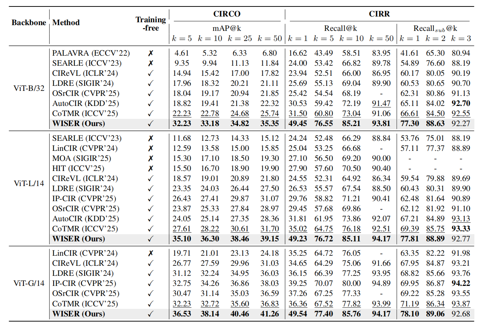
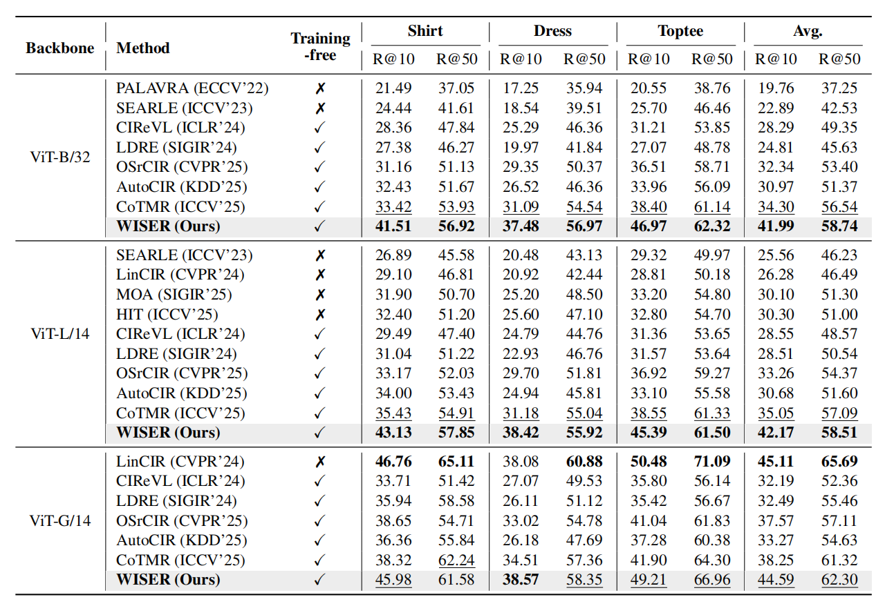

<h1 align="center">WISER: Wider Search, Deeper Thinking, and Adaptive Fusion for Training-Free Zero-Shot Composed Image Retrieval</h1>

  If you find this project useful, please give us a star 🌟.

## 🔥 News

- [x] **[2026/2/23]** Our paper has been accepted to **CVPR 2026**!
- [x] **[2026/2/26]** We release our paper in the [arxiv](https://arxiv.org/abs/).
- [ ] Code is coming soon.

## 🔎 Overview

**Overview of the proposed WISER framework.** (1) Wider Search. We leverage an editor to produce text and image queries for dual-path retrieval, aggregating the top-$K$ results into a unified candidate pool.
  (2) Adaptive Fusion. We employ a verifier to assess the candidates with confidence scores, applying a multi-level fusion strategy for high-confidence results and triggering refinement for low-confidence ones.
  (3) Deeper Thinking. For uncertain retrievals, we leverage a refiner to analyze unmet modifications and then feed targeted suggestions back to the editor, iterating until a predefined limit is reached.

## 📊 Main Results

WISER significantly outperforms previous methods across multiple benchmarks, achieving relative improvements of 45% on CIRCO (mAP@5) and 57% on CIRR (Recall@1) over existing training-free methods. Notably, it even surpasses many training-dependent methods, highlighting its superiority and generalization under diverse scenarios. 

## 📄 Citation

